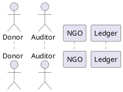

# Blockchain-Based NGO Donation Auditing Framework

## Overview

This project provides a tamper-evident, auditable donation management framework for NGOs, donors, regulators, and auditors.  
It ensures that every donation, disbursement, invoice, and field proof is:

- **Cryptographically signed and immutable**
- **Anchored on a permissioned ledger with public blockchain notarization**
- **Auditable via exportable snapshots (CSV/PDF) with inclusion proofs**
- **Independent of NGO-provided narratives (no blind trust in uploaded docs)**

---

## 🏛️ System Architecture

**Major Components:**

### Frontends
- **Donor Portal:** Donation initiation, dashboards
- **NGO Admin Portal:** Upload documents, reconcile funds
- **Field App:** Geo-tagged proof of delivery

### Core Services
- API Gateway / Auth (JWT, OAuth)
- Identity/KYC service
- PKI/Certificate Registry
- Oracles (bank, government, suppliers)
- Merkle & Snapshot service
- Exporter (CSV/PDF + cryptographic proofs)
- Anchor Service (public blockchain notarization)
- Approval Engine (multisig policies)
- Monitoring & Audit Logs

### Blockchain Layer
- Permissioned Ledger (e.g., Hyperledger Fabric / Quorum)
- Chaincode/Smart Contracts for donation lifecycle & doc refs

### Storage
- Off-chain encrypted storage (IPFS/S3)
- Relational DB (Postgres)

---

## 📊 Diagrams

System and dataflow are modeled using PlantUML.

### System Architecture Diagram
```plantuml
@startuml
!includeurl https://raw.githubusercontent.com/plantuml-stdlib/C4-PlantUML/master/C4_Component.puml
' Refer to /docs/system_architecture.puml for full detailed diagram
@enduml
```

### Donation–Audit Sequence


👉 **Full detailed PlantUML diagrams are available in the `/docs` folder:**
- `system_architecture.puml`
- `donation_audit_sequence.puml`

---

## 🔐 Audit & Proof Mechanism

- **Document Hashing:** All documents (invoices, photos, approvals) → sha256
- **Merkle Rooting:** Canonicalized records form leaves in a Merkle tree
- **Anchoring:** Root anchored on a public blockchain (e.g., Ethereum, Polygon)
- **Signed Snapshots:** At audit time, NGO exports:
  - `records.jsonl`
  - `records.csv` / `report.pdf`
  - `proofs.json` (Merkle inclusion proofs)
  - `signature.sig` (signed metadata)
  - `anchor_receipt.json` (public chain tx)

**Auditor Verification:**
- Verifies NGO’s digital signature
- Recomputes hashes & proofs
- Cross-checks with anchor root on public blockchain
- Validates vendor/bank signatures against PKI

> NGO-provided documents cannot be faked without detection, since proofs and public anchoring tie them to immutable state.

---

## 🚀 How to Run

1. **Install Requirements**
    ```bash
    pip install -r requirements.txt
    # Requirements include: flask, fastapi, hyperledger-fabric-sdk-py, web3, cryptography, graphviz
    ```

2. **Generate Diagrams**
    ```bash
    plantuml docs/system_architecture.puml
    plantuml docs/donation_audit_sequence.puml
    ```

3. **Run Dev Server**
    ```bash
    python app.py
    ```

4. **Request an Audit Snapshot**
    ```bash
    curl http://localhost:8000/export/snapshot?project_id=xyz > snapshot.zip
    ```

5. **Auditor Verification**
    Unpack `snapshot.zip` and verify:
    ```bash
    python verify_snapshot.py snapshot.zip
    ```

---

## 📂 Repository Structure

```
/app
  ├── api/            # REST/GraphQL endpoints
  ├── chaincode/      # Smart contracts
  ├── services/       # Oracles, Merkle, Exporter
  ├── storage/        # Off-chain storage handlers
/docs
  ├── system_architecture.puml
  ├── donation_audit_sequence.puml
/tests
  ├── test_snapshot_verification.py
```

---

## 🧑‍⚖️ Roles

- **Donors:** Make donations, track flows
- **NGOs:** Manage funds, upload documents
- **Vendors:** Issue cryptographically signed invoices
- **Regulators:** Receive reports, ensure compliance

---

## ✅ Guarantees

- **Tamper-evident:** Every record linked by cryptographic proofs
- **Independent auditability:** Auditors don’t need to trust NGO-provided files blindly
- **End-to-end transparency:** From donation → payment → disbursement → field proof → audit
